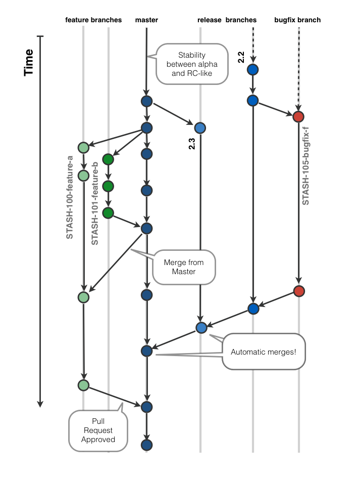

class: middle, center
background-image: url(background-intro.png)

# git workflows

---
class: middle, center
background-image: url(background.png)

## Ziele

---
class:
background-image: url(background.png)

.right_column[
### Ziele

git Workflows sollen

* die Projektstruktur unterstützen
* die Flexibilität von git nutzen
* die Qualität des Codes verbessern
* zur Sicherheit der Entwickler beitragen
* die Akzeptanz von VCS steigern
* Agilität fördern
]

---
class: middle, center
background-image: url(background.png)

## Landschaft

---
class:
background-image: url(background.png)

.right_column[

### Landschaft

**systeme**

1. CI-Server
1. Build-Server/ Test-Server
1. Ticket-System - Support
1. Entwicklung

**Personen**
1. Entwickler
1. Reviewer
1. Produkt Owner
1. Kunde
]

---
class:
background-image: url(background.png)

.right_column[

### Landschaft

**Bild der Landschaft**
]

---
class: middle, center
background-image: url(background.png)

## Workflow Typen

---
class:
background-image: url(background.png)

.right_column[

### Workflow Typen

git ist Flexibel. Die Workflows auch:

* Zentralisiert
* Verteilt
* Baumartig
* Silos
* Wenige/Viele Entwickler
* Gemischte Domänen (Hard-/ Software)

Gerne werden Aspekte kombiniert.
]

---
class:
background-image: url(background.png)

.right_column[

### Workflow Typen

**Beispiel zentraler Workflow**

1. git flow
2. Stash

-> Beliebt im Enterprise Umfeld

Häufig bei cloesd Source Projekten 

]

---
class:
background-image: url(background.png)

.right_column[

### Workflow Typen
**Beispiel dezentraler Workflow**

1. Kernel Entwicklung
2. Public-Repository (Pull-Requests)

-> de facto Standard bei OpenSource Projekten

]

---
class:
background-image: url(background.png)

.right_column[

### Basic Workflows

**Einfaches Team**

The simplest setup you’re likely to encounter is a private project with one or two other developers. “Private,” in this context, means closed-source – not accessible to the outside world. You and the other developers all have push access to the repository.

In this environment, you can follow a workflow similar to what you might do when using Subversion or another centralized system. 
]

---
class:
background-image: url(background.png)

.right_column[

### Basic Workflows

**Einfaches Team**

**INSERT IMAGE..**

]

---
class:
background-image: url(background.png)

.right_column[

### Basic Workflows

**Kleines Managed Team**

Many groups switch to Git because of this ability to have multiple teams working in parallel, merging the different lines of work late in the process. The ability of smaller subgroups of a team to collaborate via remote branches without necessarily having to involve or impede the entire team is a huge benefit of Git. The sequence for the workflow you saw here is something like this:
]

---
class:
background-image: url(background.png)

.right_column[

### Basic Workflows

**Kleines Managed Team**

**INSERT IMAGE..**

]

---
class:
background-image: url(background.png)

.right_column[

### Basic Workflows

**Forked Public Project**

]

---
class:
background-image: url(background.png)

.right_column[

### Basic Workflows

**Forked Public Project**

**INSERT IMAGE..**
]

---
class: middle, center
background-image: url(background.png)

## Start eines Workflows

---
class:
background-image: url(background.png)

.right_column[

### Start eines Workflows

Wie **startet** ein Branch

* feature
* hotfix
* support

]

---
class:
background-image: url(background.png)

.right_column[

### Start eines Workflows

Wie **endet** ein Branch

* develop
* master
  * release
]

---
class: middle, center
background-image: url(background.png)

## Ende eines Workflows

---
class:
background-image: url(background.png)

.right_column[

### Ende eines Workflows

Tests erfolgreich!
-> Code Review

]

---
class: middle, center
background-image: url(background.png)

## Code Reviews

---
class:
background-image: url(background.png)

.right_column[

### Code Reviews

[Code Reviews](http://blogs.atlassian.com/2014/03/every-team-needs-kick-ass-code-reviews/)
]

---
class: middle, center
background-image: url(background.png)

## Pull Requests

---
class:
background-image: url(background.png)

.right_column[

### Pull Requests

Entwickler

Reviewer

]

---
class: middle, center
background-image: url(background.png)

## Vorstellung spezieller Workflows

---
class:
background-image: url(background.png)

.right_column[

### GitHub- Workflow

Aufbauend auf Pull Requests.
]

---
class:
background-image: url(background.png)

.left_column[

]
.right_column[

### Stash_Workflow

Etwas andere Variante des GitHub- WF

* Der master-Zweig wird stabil gehalten, nicht aber in Produktionsqualität wie beim GitHub-Workflow
* Die Qualität bzw. Buildstabilität schwankt zwischen „Alpha“ und „Release Candidate“. Unterstützt wird dies durch den Einsatz von branch-aware Continous Integration, automatischer Testabdeckung und Performance-Monitoring der Buildresultate.
* Pro User Story ein Zweig (wird von master aus erstellt)
* Pro Release ein Zweig
* Pro Bugfix ein Zweig (automatisch zurück integriert in Release-Zweig)
* Pull Requests werden für fertige Implementierungen erstellt und nach einem erfolgten Code Review durch mindestens zwei Team-Mitglieder in den master-Zweig aufgenommen.
]

---
class:
background-image: url(background.png)

.right_column[

### git-flow

[git flow](http://7minds.github.io/git-flow-bestpractice)

Dauerhafte Zweige:
* develop: Enthält die zurzeit in Entwicklung befindliche Codebasis. Aktuellster Stand immer im zentralen Repo.
* master: Enthält Snapshots von stabilen (= getesteten, gereviewten) Ständen der Codebasis. Aktuellster Stand ist immer im zentralen Repo.

Temporäre Branches:
* Feature-Branches: Werden vom Entwickler erstellt, z.B. wenn ein Ticket, welches ein Feature beschreibt, bearbeitet wird. Abgeschlossene Arbeiten werden nach develop gemerged
* Release-Branches: Werden von develop gebranched und enthalten den Veröffentlichungskandidaten. In Release-Branches werden keine neuen Features implementiert, sondern nur noch Fehler ausgemerzt und die Codebasis nochmals intensiv getestet.

]
---
class:
background-image: url(background.png)

.right_column[

### git-Workflow

Many groups switch to Git because of this ability to have multiple teams working in parallel, merging the different lines of work late in the process. The ability of smaller subgroups of a team to collaborate via remote branches without necessarily having to involve or impede the entire team is a huge benefit of Git. The sequence for the workflow you saw here is something like this:
]
